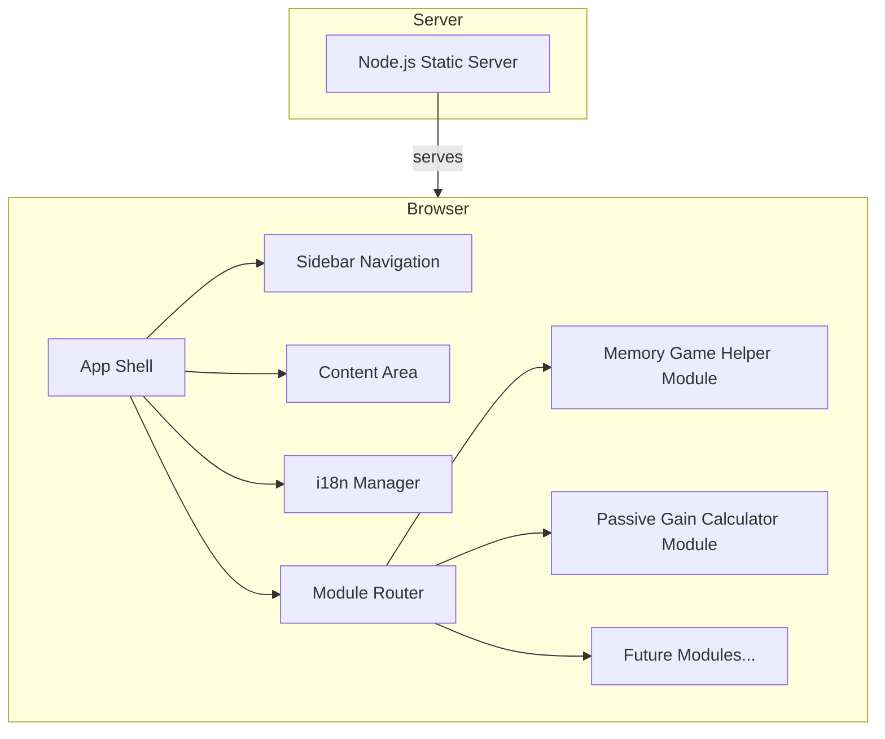
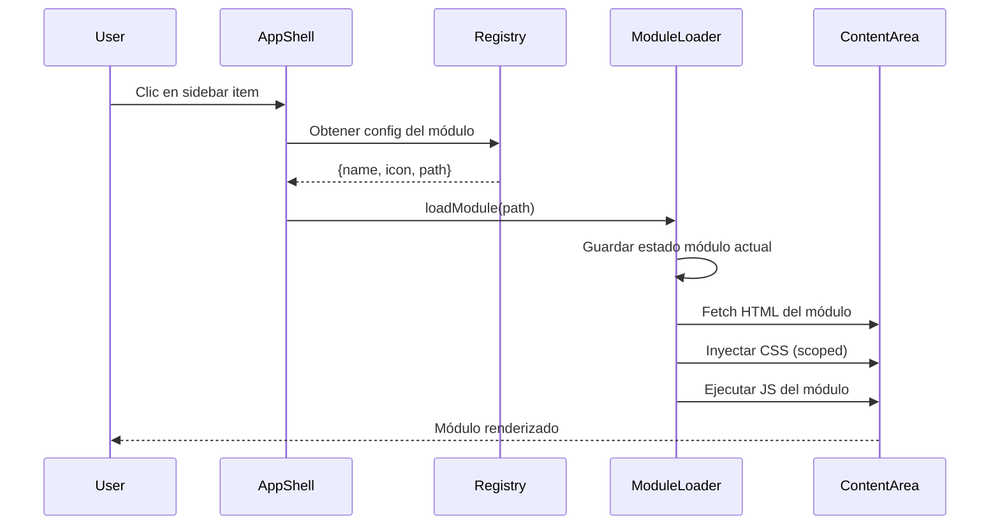

# Design Document: Sidebar Multi-Utility App

## Overview

La aplicación se refactoriza desde un único archivo HTML monolítico a una arquitectura multi-utilidad con navegación lateral. El sistema se compone de:

1. **App Shell**: Estructura contenedora con sidebar fijo y área de contenido dinámica.
2. **Módulos de utilidad**: Componentes independientes (Memory Game Helper, Calculador de Ganancia Pasiva) cargados dinámicamente.
3. **Sistema i18n**: Traducciones JSON por idioma con detección automática y persistencia.
4. **Servidor estático**: Servidor Node.js sin dependencias externas para servir archivos.

### Decisiones de diseño clave

| Decisión | Elección | Justificación |
|----------|----------|---------------|
| Servidor | Node.js vanilla (`http` + `fs`) | 0 dependencias externas, cumple restricción de máx. 1 |
| Carga de módulos | Fetch dinámico + innerHTML | Compatible con todos los navegadores, aislamiento sencillo |
| Aislamiento CSS | Prefijo de clase por módulo (`mod-memory-*`, `mod-calc-*`) | Más simple que Shadow DOM, sin polyfills |
| i18n | Archivos JSON por locale | Ligero, extensible, carga bajo demanda |
| Estado de módulos | Preservado en memoria entre cambios de vista | Cumple requisito de restaurar estado al volver |
| Imágenes | PNG locales en `/assets/img/digimon/` | Elimina dependencia externa, funciona offline |

## Architecture

### Diagrama de componentes de alto nivel



### Diagrama de flujo de carga de módulos



### Estructura de directorios

```
digimemory/
├── server.js                    # Servidor estático Node.js
├── CHANGELOG.md                 # Historial de cambios
├── package.json                 # Metadatos y script de inicio
├── public/                      # Directorio raíz servido
│   ├── index.html               # App Shell (SPA entry point)
│   ├── css/
│   │   └── app-shell.css        # Estilos del App Shell
│   ├── js/
│   │   ├── app.js               # Inicialización del App Shell
│   │   ├── router.js            # Carga dinámica de módulos
│   │   ├── i18n.js              # Sistema de internacionalización
│   │   └── registry.js          # Lectura del registro de módulos
│   ├── config/
│   │   └── modules.json         # Registro central de utilidades
│   ├── locales/
│   │   ├── en.json
│   │   ├── es.json
│   │   ├── it.json
│   │   ├── pt.json
│   │   ├── de.json
│   │   └── ja.json
│   ├── assets/
│   │   └── img/
│   │       └── digimon/         # 12 imágenes PNG locales
│   │           ├── guilmon.png
│   │           ├── veemon.png
│   │           └── ...
│   └── modules/
│       ├── memory-helper/
│       │   ├── memory-helper.html
│       │   ├── memory-helper.css
│       │   └── memory-helper.js
│       └── passive-calc/
│           ├── passive-calc.html
│           ├── passive-calc.css
│           └── passive-calc.js
```

## Components and Interfaces

### 1. Static Server (`server.js`)

```javascript
/**
 * Inicia el servidor estático.
 * @param {object} options
 * @param {string} options.root - Directorio raíz (default: './public')
 * @param {number} options.port - Puerto (default: 8080)
 */
function startServer(options: { root?: string; port?: number }): void

/**
 * Mapeo de extensiones a Content-Type.
 */
const MIME_TYPES: Record<string, string>

/**
 * Maneja una petición HTTP:
 * - Si la ruta tiene extensión y el archivo existe → servir con Content-Type adecuado
 * - Si la ruta tiene extensión y no existe → 404
 * - Si la ruta no tiene extensión y no es un archivo → servir index.html (SPA fallback)
 */
function handleRequest(req: IncomingMessage, res: ServerResponse): void
```

### 2. App Shell (`public/js/app.js`)

```javascript
/**
 * Inicializa la aplicación:
 * - Carga el registro de módulos
 * - Inicializa i18n
 * - Renderiza el sidebar
 * - Carga el módulo por defecto
 */
function initApp(): Promise<void>

/**
 * Renderiza el sidebar con los módulos registrados.
 * @param {ModuleEntry[]} modules - Lista de módulos válidos
 */
function renderSidebar(modules: ModuleEntry[]): void

/**
 * Gestiona el estado responsive del sidebar.
 */
function initResponsive(): void
```

### 3. Module Router (`public/js/router.js`)

```javascript
/**
 * Estado en memoria de cada módulo cargado.
 */
const moduleStates: Map<string, { html: string; state: any }>

/**
 * Carga un módulo en el área de contenido.
 * - Guarda estado del módulo actual
 * - Fetch del HTML del módulo
 * - Inyecta CSS con prefijo de scope
 * - Ejecuta el JS del módulo
 * - Restaura estado si el módulo fue cargado previamente
 * @param {string} moduleId - Identificador del módulo
 * @param {ModuleEntry} config - Configuración del módulo
 * @returns {Promise<void>}
 */
function loadModule(moduleId: string, config: ModuleEntry): Promise<void>

/**
 * Guarda el estado actual del módulo activo.
 * Cada módulo expone opcionalmente getState() y setState(state).
 */
function saveCurrentModuleState(): void

/**
 * Restaura el estado previamente guardado de un módulo.
 * @param {string} moduleId
 */
function restoreModuleState(moduleId: string): void
```

### 4. i18n Manager (`public/js/i18n.js`)

```javascript
/**
 * Idiomas soportados con metadatos.
 */
const SUPPORTED_LOCALES: { code: string; name: string; nativeName: string }[]

/**
 * Inicializa el sistema i18n:
 * 1. Busca preferencia persistida en localStorage
 * 2. Si no existe, detecta idioma del navegador
 * 3. Si no coincide, usa 'en' por defecto
 * @returns {Promise<string>} Código del idioma activo
 */
function initI18n(): Promise<string>

/**
 * Cambia el idioma activo:
 * - Carga el archivo JSON del locale
 * - Actualiza todos los elementos con data-i18n
 * - Persiste la preferencia en localStorage
 * @param {string} locale - Código del idioma (en, es, it, pt, de, ja)
 */
function setLocale(locale: string): Promise<void>

/**
 * Obtiene la traducción para una clave.
 * Soporta claves anidadas con dot notation: "sidebar.title"
 * @param {string} key - Clave de traducción
 * @returns {string} Texto traducido o la clave si no existe
 */
function t(key: string): string
```

### 5. Module Registry (`public/config/modules.json`)

```javascript
/**
 * Interfaz de configuración de un módulo.
 */
interface ModuleEntry {
  id: string;           // Identificador único (kebab-case)
  name: string;         // Clave i18n para el nombre (máx. 50 caracteres)
  icon: string;         // Emoji o referencia de icono
  path: string;         // Ruta relativa al directorio del módulo
  default?: boolean;    // Si es el módulo por defecto (solo uno)
}
```

### 6. Memory Game Helper Module (`public/modules/memory-helper/`)

```javascript
/**
 * API expuesta por el módulo para gestión de estado.
 */
interface MemoryHelperModule {
  /** Retorna el estado actual (grid + history) */
  getState(): { gridState: (number | null)[]; history: number[] }
  
  /** Restaura un estado previamente guardado */
  setState(state: { gridState: (number | null)[]; history: number[] }): void
  
  /** Inicializa el módulo en el contenedor dado */
  init(container: HTMLElement): void
  
  /** Limpieza al desmontar */
  destroy(): void
}
```

### 7. Passive Gain Calculator Module (`public/modules/passive-calc/`)

```javascript
/**
 * Configuración de recompensas por intervalo de 5 minutos.
 */
interface RewardConfig {
  bits: number;              // 0 - 999,999,999
  hologramTickets: number;   // 0 - 999,999,999
  digiEmeralds: number;      // 0 - 999,999,999
}

/**
 * Configuración de esmeraldas disponibles.
 */
interface EmeraldConfig {
  dailyPullCost: number;     // 0 - 99,999 (default: 5700)
  pullTime: string;          // HH:MM formato 24h (default: "08:00")
}

/**
 * Calcula el tiempo de espera para acumular una cantidad objetivo de recursos.
 * @param {number} target - Cantidad objetivo (1 - 999,999,999)
 * @param {number} ratePerInterval - Ganancia por intervalo de 5 minutos
 * @returns {{ days: number; hours: number; minutes: number } | null}
 *   null si ratePerInterval es 0
 */
function calculateWaitTime(target: number, ratePerInterval: number): 
  { days: number; hours: number; minutes: number } | null

/**
 * Calcula las esmeraldas disponibles para gastar.
 * @param {number} currentEmeralds - Esmeraldas actuales del jugador
 * @param {number} dailyPullCost - Coste de tiradas diarias
 * @param {string} pullTime - Hora de tirada (HH:MM)
 * @param {number} emeraldRate - Tasa de generación por intervalo de 5 min
 * @param {Date} now - Momento actual (inyectable para testing)
 * @returns {{ 
 *   deadlineTime: string;        // HH:MM hora límite
 *   availableToSpend: number;    // Esmeraldas gastables
 *   canSpend: boolean;           // false si ya pasó la hora límite
 * }}
 */
function calculateAvailableEmeralds(
  currentEmeralds: number,
  dailyPullCost: number,
  pullTime: string,
  emeraldRate: number,
  now?: Date
): { deadlineTime: string; availableToSpend: number; canSpend: boolean }

/**
 * Calcula el tiempo máximo de espera entre múltiples recursos.
 * @param {Array<{target: number; rate: number}>} resources
 * @returns {{ days: number; hours: number; minutes: number } | null}
 */
function calculateMaxWaitTime(resources: Array<{target: number; rate: number}>): 
  { days: number; hours: number; minutes: number } | null

/**
 * API expuesta por el módulo.
 */
interface PassiveCalcModule {
  getState(): { rewardConfig: RewardConfig; emeraldConfig: EmeraldConfig }
  setState(state: { rewardConfig: RewardConfig; emeraldConfig: EmeraldConfig }): void
  init(container: HTMLElement): void
  destroy(): void
}
```

## Data Models

### Registro de módulos (`modules.json`)

```json
{
  "version": "1.0.0",
  "modules": [
    {
      "id": "memory-helper",
      "name": "modules.memoryHelper.name",
      "icon": "🎴",
      "path": "modules/memory-helper",
      "default": true
    },
    {
      "id": "passive-calc",
      "name": "modules.passiveCalc.name",
      "icon": "💎",
      "path": "modules/passive-calc",
      "default": false
    }
  ]
}
```

### Estructura de traducción (`locales/es.json` — ejemplo parcial)

```json
{
  "app": {
    "title": "DigiMemory",
    "version": "v{version}"
  },
  "sidebar": {
    "title": "Utilidades"
  },
  "modules": {
    "memoryHelper": {
      "name": "Memory Helper",
      "undo": "Deshacer",
      "clear": "Limpiar",
      "fullscreen": "Pantalla completa",
      "exitFullscreen": "Salir",
      "instructions": "Instrucciones",
      "confirmClear": "¿Limpiar todo el tablero?"
    },
    "passiveCalc": {
      "name": "Ganancia Pasiva",
      "rewardConfig": "Configuración de recompensas",
      "bits": "Bits",
      "hologramTickets": "Tickets de Holograma",
      "digiEmeralds": "Digiesmeraldas",
      "perInterval": "cada 5 minutos",
      "waitTime": "Tiempo de espera",
      "target": "Cantidad objetivo",
      "calculate": "Calcular",
      "result": "Resultado",
      "days": "días",
      "hours": "horas",
      "minutes": "minutos",
      "configRequired": "Configurar recompensas primero",
      "availableEmeralds": "Esmeraldas disponibles",
      "dailyPullCost": "Coste de tiradas diarias",
      "pullTime": "Hora de tirada",
      "currentEmeralds": "Esmeraldas actuales",
      "deadline": "Hora límite",
      "canSpend": "Puedes gastar",
      "cannotSpend": "No puedes gastar esmeraldas y alcanzar el objetivo"
    }
  },
  "errors": {
    "moduleNotFound": "Utilidad no disponible: {module}",
    "loadFailed": "Error al cargar la utilidad"
  },
  "language": {
    "selector": "Idioma"
  }
}
```

### Datos de Digimon (constante del módulo Memory Helper)

```javascript
const DIGIMON_DATA = [
  { id: "guilmon",     name: "Guilmon",     color: "#4a7abf", abbr: "GUI" },
  { id: "veemon",     name: "Veemon",      color: "#d4b800", abbr: "VEE" },
  { id: "renamon",    name: "Renamon",     color: "#5c2d91", abbr: "REN" },
  { id: "hawkmon",    name: "Hawkmon",     color: "#8b6914", abbr: "HAW" },
  { id: "wormmon",    name: "Wormmon",     color: "#d4760a", abbr: "WOR" },
  { id: "gomamon",    name: "Gomamon",     color: "#c94b7a", abbr: "GOM" },
  { id: "patamon",    name: "Patamon",     color: "#7b2d8b", abbr: "PAT" },
  { id: "terriermon", name: "Terriermon",  color: "#8b8b2d", abbr: "TER" },
  { id: "agumon",     name: "Agumon",      color: "#1e90d4", abbr: "AGU" },
  { id: "gabumon",    name: "Gabumon",     color: "#7b2d8b", abbr: "GAB" },
  { id: "salamon",    name: "Salamon",     color: "#2255bb", abbr: "SAL" },
  { id: "biyomon",    name: "Biyomon",     color: "#2ecc40", abbr: "BIY" }
];
// Ruta de imagen: `/assets/img/digimon/${id}.png`
```

### Estado persistido en localStorage

| Clave | Contenido | Usado por |
|-------|-----------|-----------|
| `digimemory-locale` | Código de idioma (`"es"`, `"en"`, ...) | i18n.js |
| `digimemory-passive-config` | JSON: `RewardConfig` | passive-calc.js |
| `digimemory-emerald-config` | JSON: `EmeraldConfig` | passive-calc.js |

## Correctness Properties

*A property is a characteristic or behavior that should hold true across all valid executions of a system — essentially, a formal statement about what the system should do. Properties serve as the bridge between human-readable specifications and machine-verifiable correctness guarantees.*

### Property 1: Sidebar renders all registered modules with name and icon

*For any* valid module registry containing N modules, the rendered sidebar SHALL contain exactly N items, each displaying the module's translated name and its icon.

**Validates: Requirements 1.5, 3.4**

### Property 2: Module state round-trip preservation

*For any* module with arbitrary state (e.g., a Memory Helper grid with random selections), saving the state via `getState()`, switching to another module, and restoring via `setState()` SHALL produce a state identical to the original.

**Validates: Requirements 2.4**

### Property 3: Module registry schema validation

*For any* module entry in the registry, if `name` has length > 50, or `icon` is empty, or `path` is empty/missing, the entry SHALL be rejected as invalid. Conversely, if all fields are present and within constraints, the entry SHALL be accepted as valid.

**Validates: Requirements 3.4, 3.5**

### Property 4: Server MIME type mapping correctness

*For any* file request where the file exists on disk and has a known extension (html, css, js, png, svg, webp, json), the server SHALL respond with the corresponding Content-Type header matching the extension-to-MIME mapping.

**Validates: Requirements 4.1**

### Property 5: Server SPA fallback for extensionless paths

*For any* request path that does not contain a file extension, the server SHALL respond with the contents of `index.html` and HTTP status 200.

**Validates: Requirements 4.4**

### Property 6: Server 404 for non-existent files with extension

*For any* request path that contains a file extension but does not correspond to an existing file in the root directory, the server SHALL respond with HTTP status 404.

**Validates: Requirements 4.5**

### Property 7: i18n translation completeness

*For any* supported locale and *for any* i18n key used in the application source, the locale's translation file SHALL contain a non-empty string value for that key.

**Validates: Requirements 6.1**

### Property 8: i18n DOM update consistency

*For any* DOM element with a `data-i18n` attribute and *for any* target locale, after calling `setLocale(locale)`, the element's text content SHALL equal the value of `translations[locale][key]` for its i18n key.

**Validates: Requirements 6.6**

### Property 9: Numeric input field validation

*For any* numeric input field with configured range `[min, max]` and *for any* integer value `v`: if `min ≤ v ≤ max`, the field SHALL accept the value; if `v < min` or `v > max` or `v` is non-numeric, the field SHALL reject the input and retain the previous valid value.

**Validates: Requirements 8.1, 8.2, 8.3, 8.7, 9.1**

### Property 10: Wait time calculation correctness

*For any* target amount `T > 0` and reward rate `R > 0` per 5-minute interval, `calculateWaitTime(T, R)` SHALL return a time decomposition `{days, hours, minutes}` where:
1. `totalMinutes = days × 1440 + hours × 60 + minutes`
2. `totalMinutes = ceil(T / R) × 5`
3. `minutes` is a multiple of 5
4. `0 ≤ hours < 24` and `0 ≤ minutes < 60`

**Validates: Requirements 9.2, 9.3**

### Property 11: Maximum wait time across multiple resources

*For any* non-empty list of `(target, rate)` pairs where all rates > 0, `calculateMaxWaitTime(resources)` SHALL return a result equal to the maximum of `calculateWaitTime(target, rate)` computed individually for each pair.

**Validates: Requirements 9.4**

### Property 12: Emerald availability calculation consistency

*For any* valid configuration (currentEmeralds ∈ [0, 99999], dailyPullCost ∈ [0, 99999], emeraldRate > 0, pullTime in HH:MM format) and *for any* current time `now`:
1. If `canSpend` is true, then `(currentEmeralds - availableToSpend)` plus emeralds generated between `now` and `pullTime` (using next day if pullTime already passed today) SHALL be ≥ `dailyPullCost`.
2. The `deadlineTime` SHALL equal `pullTime` minus `ceil(dailyPullCost / emeraldRate) × 5` minutes (modulo 24 hours).
3. `canSpend` SHALL be false if and only if `now` is after `deadlineTime` (considering day rollover).

**Validates: Requirements 10.4, 10.5, 10.7, 10.8**

## Error Handling

### Server Errors

| Scenario | Behavior |
|----------|----------|
| File not found (with extension) | HTTP 404 with plain text body: "Not Found" |
| File read error (permissions, etc.) | HTTP 500 with plain text body: "Internal Server Error" |
| Invalid port/directory arguments | Exit with error message to stderr |

### App Shell Errors

| Scenario | Behavior |
|----------|----------|
| `modules.json` fetch fails | Show error banner, no sidebar items rendered |
| Module HTML fetch fails | Show localized error in content area, sidebar remains functional (Req 1.7) |
| Module JS throws during init | Catch error, show error message, log to console, sidebar remains functional |
| Invalid module entry in registry | Skip invalid entry, log warning, load remaining valid modules (Req 3.5) |

### i18n Errors

| Scenario | Behavior |
|----------|----------|
| Locale file fetch fails | Fall back to English (`en`), log warning |
| Translation key missing | Return the key itself as text (avoids blank UI) |
| localStorage unavailable | Apply locale in-memory only, no persistence, no error to user (Req 6.8) |

### Passive Gain Calculator Errors

| Scenario | Behavior |
|----------|----------|
| Non-numeric input | Reject keystroke, retain last valid value (Req 8.7) |
| Value out of range | Clamp to nearest boundary or reject, retain last valid value |
| Rate is 0 when calculation requested | Show localized message: "Configure rewards first" (Req 9.5) |
| Current time past deadline | Show localized message: "Cannot spend emeralds" (Req 10.7) |
| localStorage read/write fails | Operate without persistence for current session |

## Testing Strategy

### Test Framework Selection

- **Unit & Integration tests**: Vitest (fast, ES modules native, zero-config for this project size)
- **Property-based tests**: fast-check (mature PBT library for JavaScript/TypeScript)
- **E2E/UI tests**: Playwright (for responsive sidebar, module switching interactions)

### Test Structure

```
tests/
├── unit/
│   ├── server.test.js           # Server routing and MIME logic
│   ├── i18n.test.js             # Translation loading, key lookup, fallback
│   ├── registry.test.js         # Module registry validation
│   └── passive-calc.test.js     # Calculator pure functions
├── property/
│   ├── server.property.test.js  # Properties 4, 5, 6
│   ├── i18n.property.test.js    # Properties 7, 8
│   ├── validation.property.test.js  # Property 9
│   ├── wait-time.property.test.js   # Properties 10, 11
│   └── emeralds.property.test.js    # Property 12
├── integration/
│   ├── module-loading.test.js   # Module load/unload lifecycle
│   ├── state-preservation.test.js  # Property 2 (with real DOM)
│   └── memory-helper.test.js    # Existing functionality preserved
└── e2e/
    ├── sidebar-responsive.test.js  # Responsive behavior (Req 5)
    └── language-switch.test.js     # i18n full flow
```

### Property-Based Test Configuration

- **Library**: fast-check
- **Minimum iterations**: 100 per property
- **Tag format**: `Feature: sidebar-multi-utility-app, Property {N}: {title}`

Each property test file will:
1. Reference its corresponding design property by number
2. Use fast-check arbitraries to generate valid and invalid inputs
3. Run a minimum of 100 iterations
4. Include the property tag as a comment for traceability

### Unit Test Focus Areas

- Specific examples of MIME type resolution (known extensions)
- Edge cases: empty module registry, all invalid entries, single valid entry
- Calculator with known inputs: e.g., 1000 bits target at 100/interval = 50 minutes
- Fallback behavior: missing images, missing translations
- localStorage mock: unavailable, quota exceeded

### Integration Test Focus Areas

- Full module load/unload cycle with state preservation
- Memory Helper: selectCell → deselectLast → clearAll workflow
- Server start → request → response cycle
- i18n: load locale → update DOM → switch locale → verify update

### E2E Test Focus Areas

- Responsive sidebar: viewport resize across 768px breakpoint
- Module navigation: click sidebar items, verify content changes
- Offline mode: all assets load from local files
- Language switching: full page update without reload

